# PyMOL Figure Agent

[](https://github.com/BrandonGBz/pymol-figure-agent/actions/workflows/ci.yml)
[](LICENSE)
[](CHANGELOG.md)
[](https://www.python.org/)
[](README.md)
[](https://anaconda.org/conda-forge/pymol-open-source)
[](https://fastapi.tiangolo.com)
[](CITATION.cff)

PyMOL Figure Agent is an open-source, local agent-ready PyMOL control layer for molecular visualization, structural inspection, alignment, measurement and reproducible figure generation.

This project is not limited to a specific protein family, ligand type, metal site or research topic. Public examples such as `1GYC`, `1KYA`, `6LU7` and `6VMB` are included only to demonstrate reproducible workflows. Users can run the API locally with their own structures, ligands, docking poses, models, trajectories or PyMOL-compatible files.

<p align="center">
  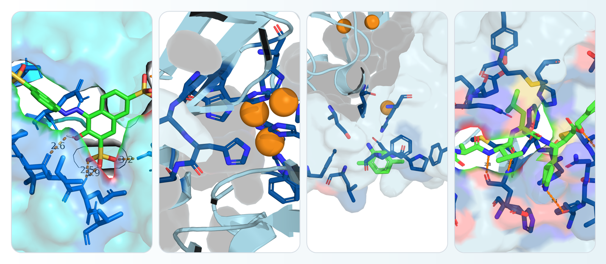
</p>

<p align="center">
  <b>Generate reproducible molecular figures from JSON prompts, scripts, notebooks, or AI-agent workflows.</b>
</p>

## What problem does it solve?

PyMOL is powerful, but reproducible molecular scene building often depends on manual GUI steps or ad hoc scripts. This project exposes a local FastAPI service so humans, notebooks, and AI coding agents can request controlled PyMOL operations, analysis and exports through JSON.

## Intended users

- Structural bioinformaticians
- Wet-lab scientists
- Graduate students
- Educators
- AI coding agents

## Main features

- Local PyMOL control through structured API operations.
- Scene building: `show`, `hide`, `color`, `remove`, `label`, `orient` and `zoom`.
- Molecular inspection, site analysis, distance measurement and structural alignment.
- PNG export for figures.
- Optional `.pse` export for manual refinement in native PyMOL.
- Optional `.pml` export for reproducible scripts.
- Metadata JSON for AI agents, notebooks and workflow tracking.
- Public examples for documentation, local user data for real workflows.

## Beyond rendering: agent-ready structural analysis

PyMOL Figure Agent also exposes descriptive structural analysis endpoints for reproducible, geometry-driven workflows.

- `POST /inspect` for structure summaries, chain counts, ligand inventory, and basic composition.
- `POST /measure/distance` for deterministic atom-to-atom or centroid distances using structured selectors.
- `POST /analyze/site` for residue neighborhoods around a ligand, metal, or other anchor selection.
- `POST /align` for reproducible structural alignment with public examples such as `1GYC` and `1KYA`.

These tools are intended for geometric inspection and reporting, not for experimental validation of binding, catalysis, stability, or mechanism.

PyMOL Figure Agent lets AI agents build molecular scenes through structured PyMOL operations, including rendering, coloring, hiding, removing selections, labeling, measuring distances, aligning structures and exporting editable sessions.

See also: [docs/scene-operations.md](docs/scene-operations.md)

## Structured PyMOL operations

Presets are convenient starting points, but they are not the limit of the API. The goal is for an agent to translate user instructions in natural language into controlled JSON operations that PyMOL can execute locally.

Current structured operations include:

- `show`
- `hide`
- `color`
- `remove`
- `select`
- `label`
- `zoom`
- `orient`
- `center`
- `set_representation`
- `set_background`
- `set_transparency`

Example conceptual request:

```json
{
  "pdb_id": "1GYC",
  "output_name": "custom_scene",
  "operations": [
    {"action": "remove", "selection": "solvent"},
    {"action": "show", "representation": "cartoon", "selection": "polymer.protein"},
    {"action": "color", "selection": "chain A", "color": "slate"},
    {"action": "show", "representation": "sticks", "selection": "organic"},
    {"action": "show", "representation": "spheres", "selection": "elem Cu"},
    {"action": "label", "selection": "elem Cu", "text": "Cu"},
    {"action": "zoom", "selection": "organic or elem Cu", "buffer": 6}
  ],
  "ray": true,
  "export_session": true,
  "export_script": true
}
```

This example is representative, not special to a particular protein family or metal site. The same structured approach can be used for proteins, ligands, docking poses, assemblies, and future trajectory-based workflows.

Example agent prompt:

```text
Use the local PyMOL API at http://127.0.0.1:8010.
Inspect public PDB 1GYC, measure a metal-to-residue distance, analyze the site, and align 1GYC against 1KYA.
Return structured JSON plus any artifact paths.
```

## Project status

Current release `v0.2.0`. The API is usable locally and continues to evolve toward a stable `v1.0.0` surface.

## Requirements

- Python 3.10+ (bundled automatically if not found)
- PyMOL Open Source installed through conda-forge
- micromamba or conda recommended (auto-downloaded by `install.sh` if missing)
- Windows 10/11, Linux x86_64, macOS Intel, and macOS Apple Silicon

PyMOL is intentionally not installed from `pip` in this project. On Windows, `pip install pymol-open-source` may fail because of native DLL dependencies. Use conda-forge instead.

## Quick installation

Windows:

```powershell
git clone https://github.com/BrandonGBz/pymol-figure-agent.git
cd pymol-figure-agent
.\install.ps1
.\start_server.ps1
```

One-command Windows install:

```powershell
.\install.ps1 -Start
```

Linux/macOS:

```bash
git clone https://github.com/BrandonGBz/pymol-figure-agent.git
cd pymol-figure-agent
chmod +x install.sh start_server.sh
./install.sh
./start_server.sh
```

One-command Linux/macOS install:

```bash
./install.sh --start
```

Open the API docs:

```text
http://127.0.0.1:8010/docs
```

| Platform | Status | Notes |
|---|---|---|
| Windows 10/11 | Tested | Recommended development path |
| Linux x86_64 | Tested | Headless systems may need Xvfb/OpenGL setup |
| macOS Intel | Tested | conda-forge PyMOL required |
| macOS Apple Silicon | Tested | conda-forge provides native osx-arm64 builds |

## Quick use

Health check:

```bash
curl http://127.0.0.1:8010/health
```

```powershell
Invoke-RestMethod -Uri "http://127.0.0.1:8010/health"
```

Render a public structure with a simple preset:

```bash
curl -X POST http://127.0.0.1:8010/render \
  -H "Content-Type: application/json" \
  -d '{"pdb_id":"1GYC","output_name":"1gyc_publication_cartoon","preset":"publication_cartoon","color":"chainbow","ray":true}'
```

```powershell
$body = @{
  pdb_id = "1GYC"
  output_name = "1gyc_publication_cartoon"
  preset = "publication_cartoon"
  color = "chainbow"
  ray = $true
} | ConvertTo-Json

Invoke-RestMethod -Uri "http://127.0.0.1:8010/render" -Method Post -ContentType "application/json" -Body $body
```

Python example:

```python
import requests

payload = {
    "pdb_id": "1GYC",
    "output_name": "1gyc_publication_cartoon",
    "preset": "publication_cartoon",
    "color": "chainbow",
    "ray": True,
}

response = requests.post("http://127.0.0.1:8010/render", json=payload, timeout=240)
response.raise_for_status()
print(response.json()["image_path"])
```

## Example for AI agents

Prompt:

```text
Use the local PyMOL API at http://127.0.0.1:8010.
Load public PDB 1GYC, render a clean publication-style PNG, and return image_path.
```

Agent JSON:

```json
{
  "pdb_id": "1GYC",
  "output_name": "1gyc_publication_cartoon",
  "preset": "publication_cartoon",
  "color": "chainbow",
  "ray": true
}
```

## Visual gallery

These figures are meant to look closer to what you would place in a manuscript, thesis, or project landing page: contrasting palettes, transparent surfaces, aligned overlays, and annotated structural views generated locally.

<table>
  <tr>
    <td width="33.3%">
      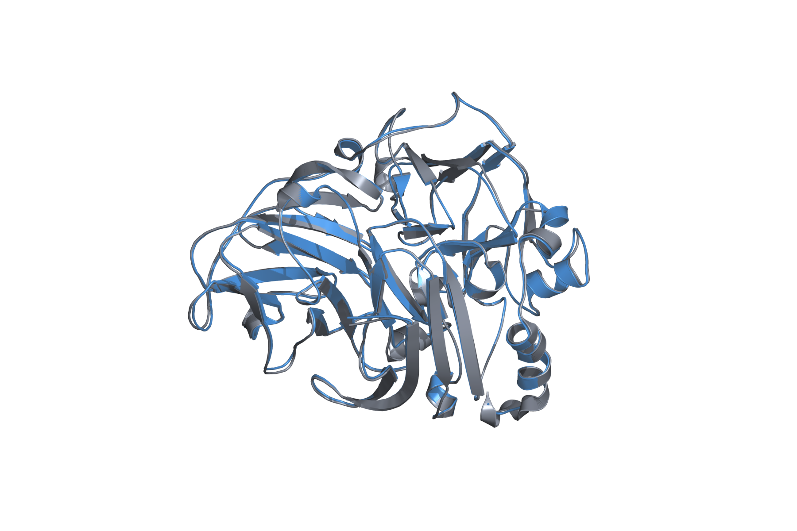
      <br>
      <b>Protein superposition</b>
      <br>
      Structural overlay of two related public proteins with a clean, publication-style color palette.
    </td>
    <td width="33.3%">
      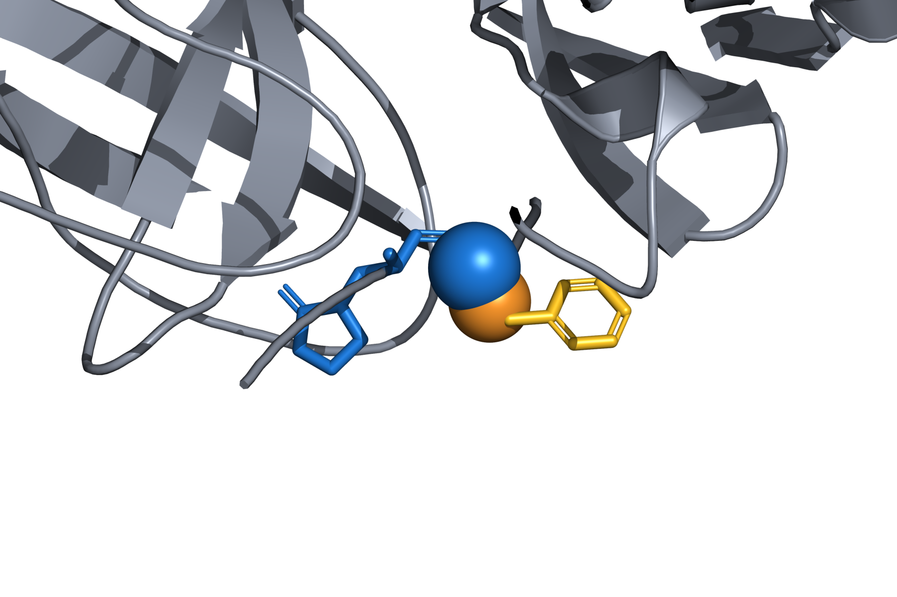
      <br>
      <b>Distance measurement</b>
      <br>
      A close-up pocket view with a clear distance annotation for common PyMOL analysis workflows.
    </td>
    <td width="33.3%">
      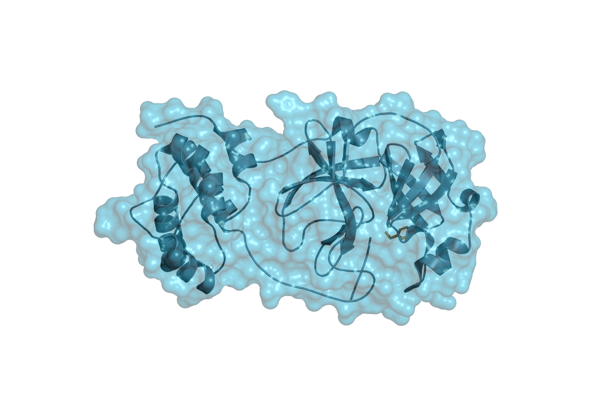
      <br>
      <b>Structured scene composition</b>
      <br>
      A polished example of common molecular scene operations in a single exported figure.
    </td>
  </tr>
</table>

Reusable rendering recipes help users create whole-structure overviews, metal-site figures, ligand-pocket close-ups, docking-style contact maps, translucent surfaces, and large complex views without rebuilding every scene by hand in the PyMOL GUI.

## Example outputs

<table>
  <tr>
    <td width="50%">
      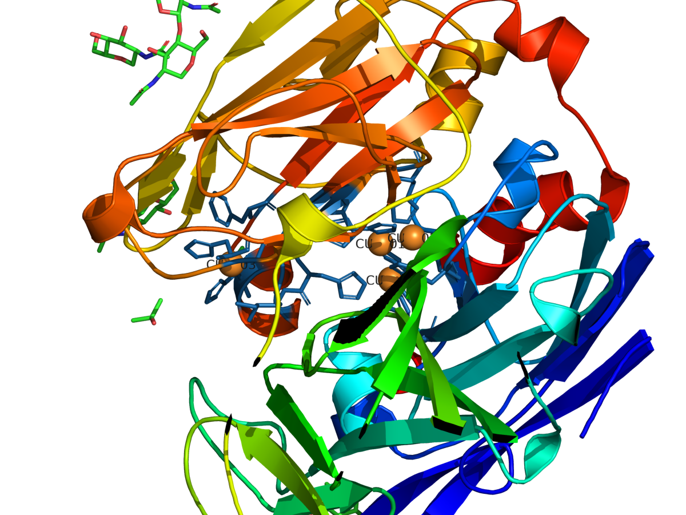
      <br>
      <b>Metal-site visualization</b>
      <br>
      Highlight metal centers and nearby structural context in public example structures such as <a href="https://www.rcsb.org/structure/1GYC">1GYC</a>. This is a demonstration of metal-site visualization, not the only use case.
    </td>
    <td width="50%">
      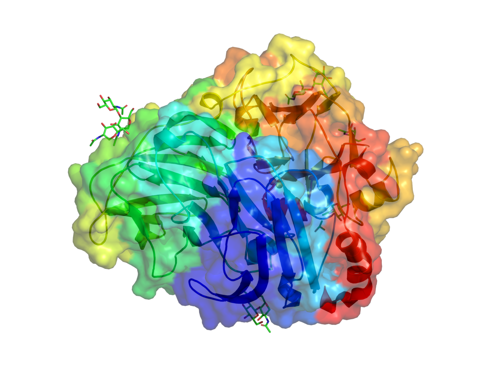
      <br>
      <b>Transparent molecular surfaces</b>
      <br>
      Show pocket shape while preserving the fold context behind the surface.
    </td>
  </tr>
  <tr>
    <td width="50%">
      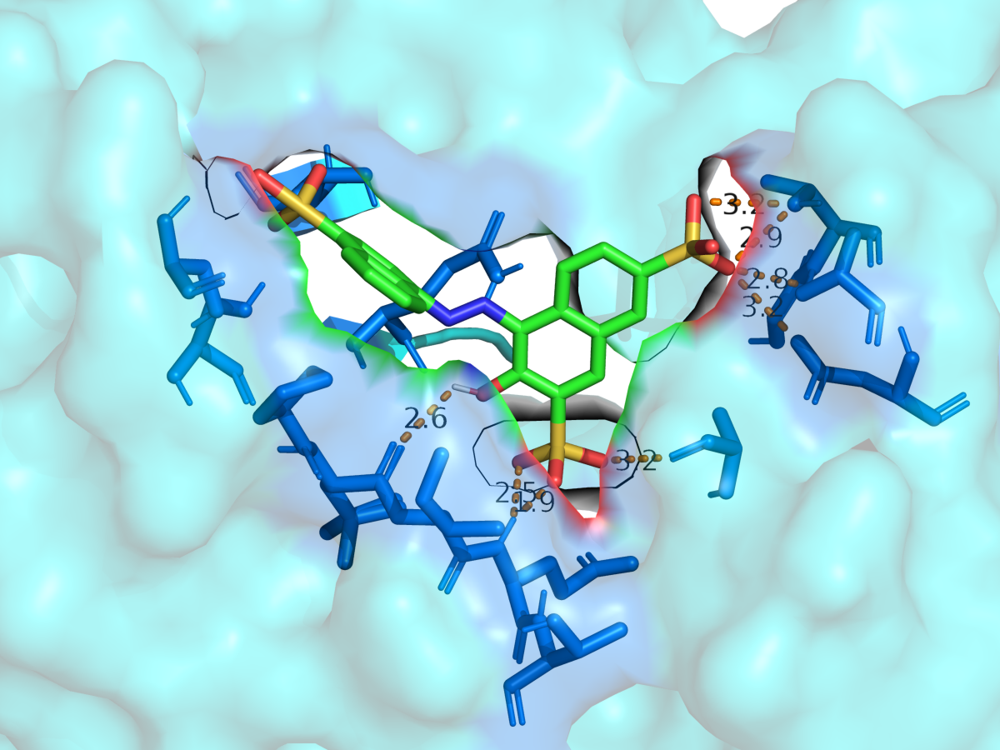
      <br>
      <b>Docking-style ligand focus</b>
      <br>
      Frame ligands, nearby residues, and distance annotations as a compact visual result.
    </td>
    <td width="50%">
      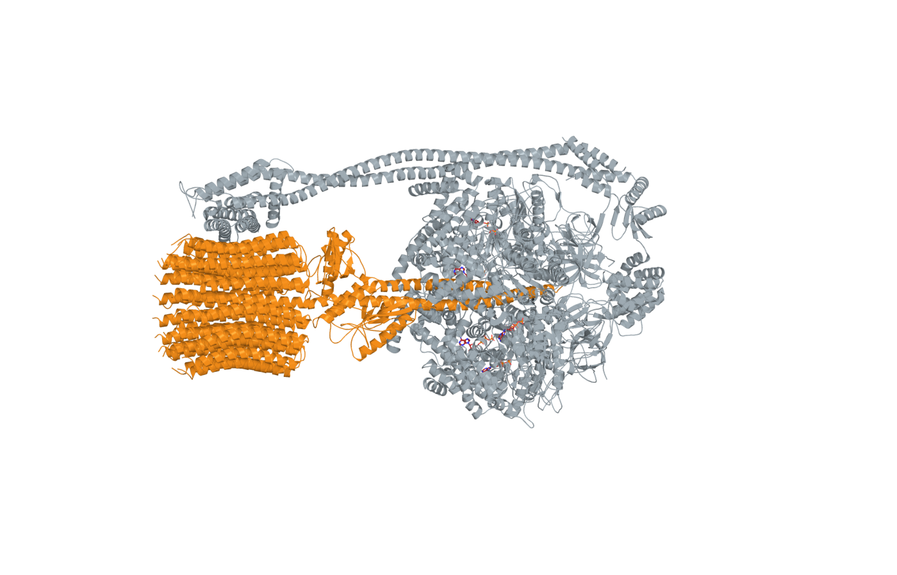
      <br>
      <b>Large enzyme-complex overview</b>
      <br>
      Create presentation-ready structural overviews for large public complexes such as <a href="https://www.rcsb.org/structure/6VMB">6VMB</a>.
    </td>
  </tr>
</table>

<details>
<summary><b>More public example renders</b></summary>

<br>

<table>
  <tr>
    <td width="50%">
      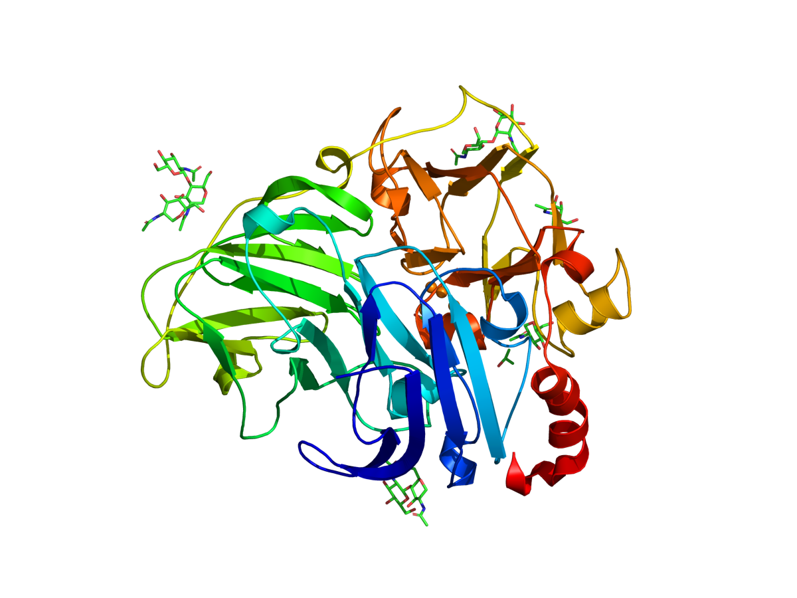
      <br>
      <b>Publication cartoon</b>
      <br>
      A clean full-structure render for public PDB entries such as <a href="https://www.rcsb.org/structure/1GYC">1GYC</a>.
    </td>
    <td width="50%">
      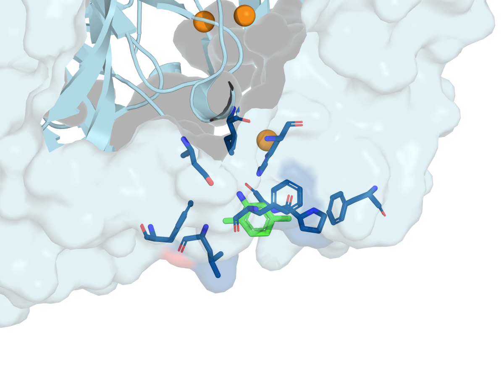
      <br>
      <b>Ligand pocket</b>
      <br>
      Surface and ligand context for public example structures such as <a href="https://www.rcsb.org/structure/1KYA">1KYA</a>.
    </td>
  </tr>
  <tr>
    <td width="50%">
      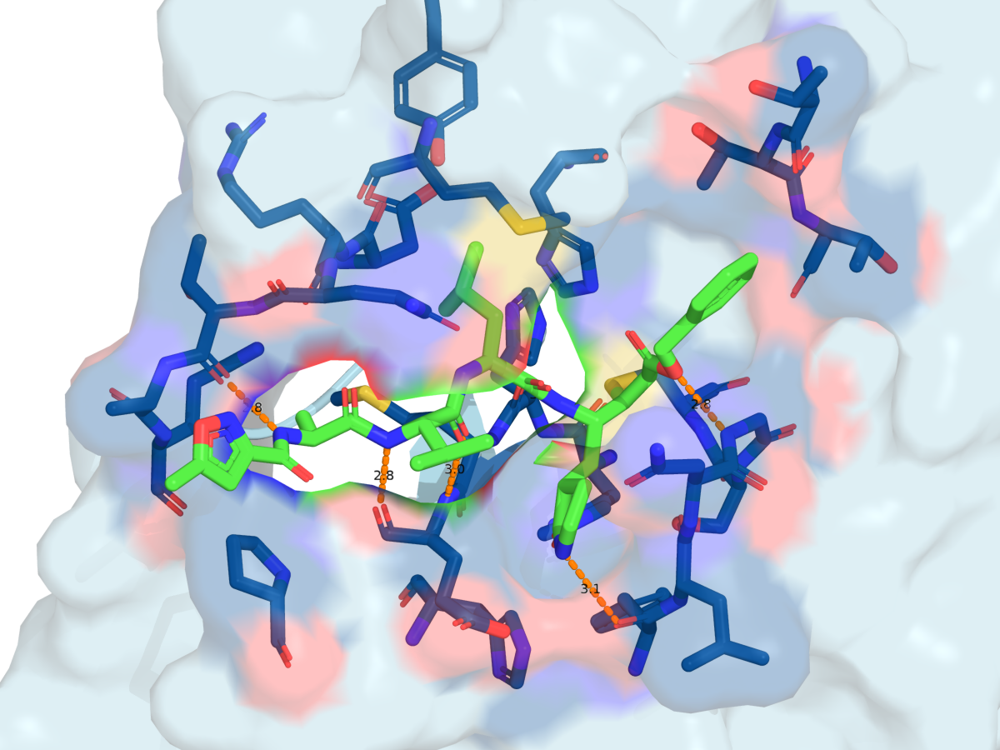
      <br>
      <b>Inhibitor-pocket view</b>
      <br>
      A close-up active-site composition for public inhibitor complexes such as <a href="https://www.rcsb.org/structure/6LU7">6LU7</a>.
    </td>
    <td width="50%">
      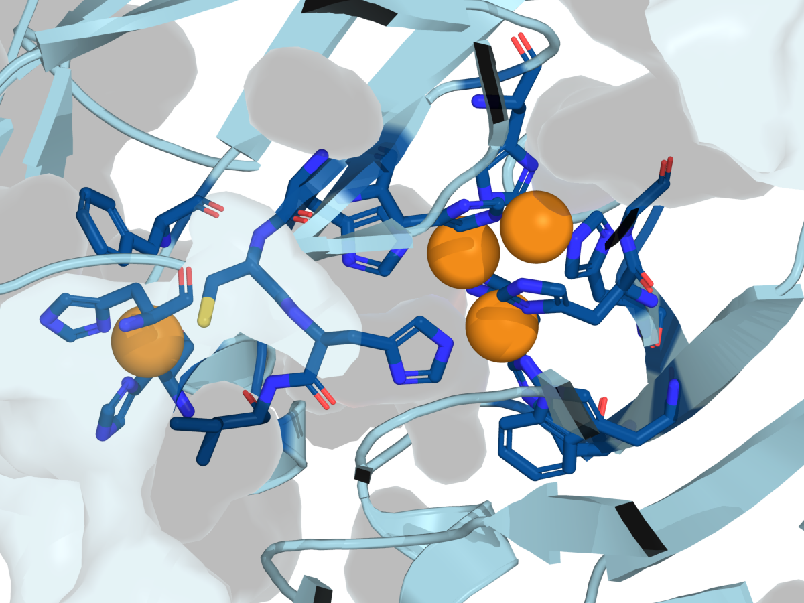
      <br>
      <b>Monochrome pocket style</b>
      <br>
      Use one dominant enzyme color with metals and residues as high-contrast accents.
    </td>
  </tr>
</table>

</details>

All examples use public PDB structures. No private coordinates, unpublished research data, local paths, PyMOL sessions, or generated output folders are included in this repository.

Runtime outputs such as `outputs/`, `sessions/`, `scripts/`, `.pse` sessions, logs, and generated render artifacts stay local to each user and are not committed to the repository.

Future gallery examples planned include batch comparison panels, mutation-site highlights, electrostatic-style surfaces, residue-distance callouts, before/after preset comparisons, and thesis or manuscript figure templates that use only public or user-approved structures.

Example JSON used for the public `1GYC` transparent surface render:

```json
{
  "pdb_id": "1GYC",
  "output_name": "1gyc_transparent_surface",
  "preset": "surface",
  "representations": ["cartoon"],
  "color": "spectrum",
  "surface_transparency": 0.42,
  "width": 1200,
  "height": 900,
  "dpi": 220,
  "ray": true
}
```

## From prompt to figure

```text
AI agent / script / notebook
        ↓
JSON request
        ↓
Local FastAPI bridge
        ↓
PyMOL render
        ↓
PNG + metadata + reproducible workflow
```

## Limitations

- This project is local-first and should not be exposed directly to the internet.
- CI does not install PyMOL yet; real rendering tests are local/manual.
- Local file paths are OS-specific.
- Some PyMOL installations differ in command-line behavior.

## Security

Run the API on `127.0.0.1` by default. Do not expose it publicly without authentication, sandboxing, and input allowlists. Do not share private structures, unpublished research data, credentials, or absolute local paths in examples, issues, logs, or pull requests.

## Roadmap

See [docs/roadmap.md](docs/roadmap.md) for the full roadmap including virtual screening,
molecular dynamics, and agent automation workflows.

- `v0.1.x`: hardening, more presets, better errors, more tests.
- `v0.2.x`: structured scene operations, editable `.pse` export, reproducible `.pml` export, selection-based remove/hide/show/color, distance and alignment workflows.
- `v0.3.x`: MCP tools wrapping structured operations, agent tool schemas, scene recipe templates.
- Future: virtual screening workflows, molecular dynamics snapshot rendering, agent automation rules.
- `v1.0.0`: stable public release.

## Citation

If you use PyMOL Figure Agent in academic work, please cite the software using the metadata in [CITATION.cff](CITATION.cff). A Zenodo DOI will be added after the first archived GitHub release is published through Zenodo. See [docs/zenodo.md](docs/zenodo.md) for details.

## MCP server

PyMOL Figure Agent can optionally expose its local PyMOL control layer through
[MCP](https://modelcontextprotocol.io) tools, allowing compatible AI agents to render
molecular figures, inspect structures, measure distances, analyze sites and align
structures through structured tool calls.

```bash
pip install -r requirements-mcp.txt
python mcp_server.py
```

See [docs/mcp.md](docs/mcp.md) for full documentation including tool descriptions,
client configuration, and security considerations.

## License

Apache License 2.0. See [LICENSE](LICENSE).

## Disclaimer

This project is not affiliated with, endorsed by, or sponsored by Schrodinger or the official PyMOL project. Users must comply with the licenses of PyMOL and all third-party dependencies.
